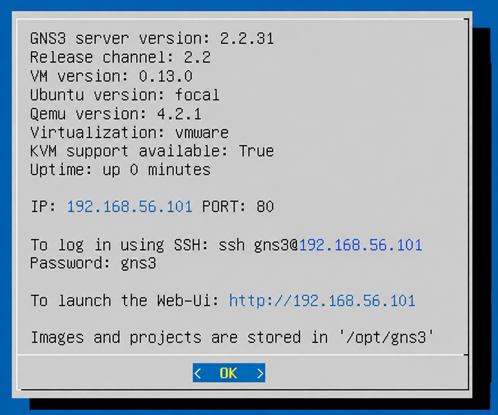

# Week 01 Tutorial – Introduction to GNS3

**Unit:** COIT20261 Network Services and Automation  
**Student ID:** 12320906  

---

# Section A – Unit and Software Setup

## 1. Understanding the Unit

In Week 01, I reviewed the COIT20261 Network Services and Automation unit and became familiar with the practical activities, portfolio requirements and assessment tasks.

The weekly practical work will be documented in GitHub as part of my portfolio.

---

## 2. Software Setup

The main software required for the practical activities includes:

- VirtualBox
- GNS3
- GitHub
- Linux virtual hosts

I checked the required networking environment and accessed the GNS3 server.

The following screenshot shows the GNS3 server information.

The GNS3 server was available using:

    IP Address: 192.168.56.101
    Port: 80

The Web UI could therefore be accessed through the GNS3 server at this IP address.

This confirmed that the GNS3 environment was available for performing the networking practical activities.

---

## 3. GitHub Repository

A GitHub repository was prepared for COIT20261 to store my weekly tutorial work.

The repository is used to maintain:

- Weekly portfolio documentation
- Practical screenshots
- Network configuration evidence
- Commands used during practical activities
- Reflections and learning outcomes

Markdown is used to organise and present the weekly portfolio work clearly.

---

# Section B – Task 1: Introduction to GNS3 Basics

## Aim

The aim of this activity was to become familiar with the basic functions of GNS3.

The activity involved:

- Creating a GNS3 project
- Adding a Linux Host
- Configuring a static IPv4 address
- Starting the Linux Host
- Opening the Linux console
- Checking the configured IP address
- Becoming familiar with basic Linux networking commands

---

## Step 1 – Create the GNS3 Project

I opened GNS3 and created a project for the introductory practical activity.

A single Linux Host named **Host1** was added to the GNS3 workspace.

The following screenshot shows Host1 added to the project.

 

This was my first basic GNS3 topology for this unit.

The activity helped me understand how to add and position a network node inside the GNS3 workspace.

---

## Step 2 – Configure a Static IPv4 Address

The next step was to understand how a static IPv4 address can be configured on a Linux Host.

The Week 01 tutorial uses the Linux `/etc/network/interfaces` file for configuring the first Ethernet interface, `eth0`.

The general configuration is:

    auto eth0
    iface eth0 inet static
        address <ipaddress>
        netmask <networkmask>

The actual IP address and network mask must replace the placeholder values.

For this simple activity, a default gateway was not required because the topology contained only a single Linux Host.

---

## Step 3 – IP Forwarding

The tutorial also introduced IP forwarding.

A normal Linux Host should operate as an end device rather than forwarding packets between different networks.

IP forwarding can be disabled using:

    up sysctl net.ipv4.ip_forward=0

This sets IPv4 forwarding to `0` when the interface is brought up.

This helped me understand one basic difference between a normal network host and a router.

---

## Step 4 – Start the Linux Host

After completing the network configuration, the Linux Host can be started in GNS3.

The console can then be opened in a web browser to access the Linux command-line environment.

This allows networking commands to be executed directly on the Linux Host.

---

## Step 5 – Check the IP Address

The configured IP address can be checked from the Linux console using:

    ip address show

The shorter command:

    ip addr

can also be used to display the network interfaces and their addresses.

The command output normally displays interfaces such as:

    lo

and:

    eth0

The `lo` interface represents the loopback interface, while `eth0` is the Ethernet interface used by the Linux Host.

The configured IPv4 address can be identified from the `inet` entry associated with `eth0`.

---

## Commands Used / Learned

The main networking commands and configuration introduced during this tutorial were:

    ip address show

and:

    ip addr

These commands are useful for checking network interface information and verifying the IPv4 address assigned to a Linux device.

The tutorial also introduced:

    up sysctl net.ipv4.ip_forward=0

which can be used to disable IPv4 packet forwarding on the Linux Host.

---

# Week 01 Outputs

The Week 01 tutorial introduced the following expected practical outputs:

1. A GNS3 project containing a Linux Host
2. A screenshot of the GNS3 network
3. A console check of the configured IP address
4. An exported GNS3 project
5. Portfolio documentation stored in GitHub

The screenshots available in my portfolio document the GNS3 environment and the Linux Host created during the introductory activity.

---

# What I Learned

During Week 01, I became familiar with the basic GNS3 environment and the way practical work will be documented throughout COIT20261.

I learned how to:

- Access the GNS3 server
- Create a basic GNS3 project
- Add a Linux Host to a project
- Understand static IPv4 configuration
- Identify the `eth0` network interface
- Start a Linux node
- Access the Linux console
- Check network interface information using `ip address show`
- Understand the purpose of disabling IP forwarding on a normal host
- Use GitHub and Markdown to document practical work

The activity also helped me understand the basic workflow that will be used in later tutorials when more hosts, switches, routers and networks are introduced.

---

# Reflection

Week 01 was an introductory practical that helped me become familiar with GNS3, Linux networking and GitHub portfolio documentation.

The most important part for me was understanding how GNS3 represents network devices and how Linux network interfaces can be configured and checked from the console.

Although this activity used only one Linux Host, it provided the basic knowledge required for the more complex network topologies used in later weeks.

---

# Conclusion

The Week 01 tutorial provided an introduction to the software and networking tools used in COIT20261 Network Services and Automation.

I became familiar with GNS3, added a Linux Host to a project and learned the basic process for configuring and checking an IPv4 address on a Linux network interface.

These skills provide a foundation for the networking, routing and network services activities completed in the following tutorials.
