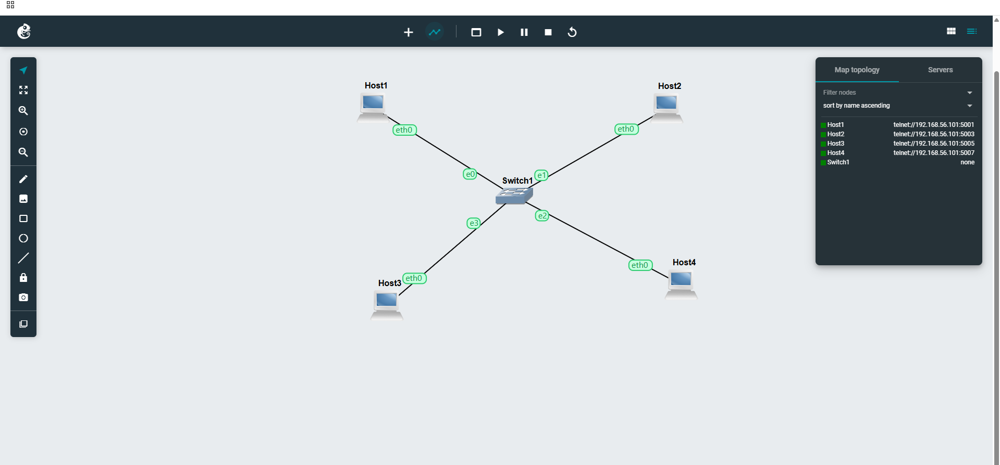
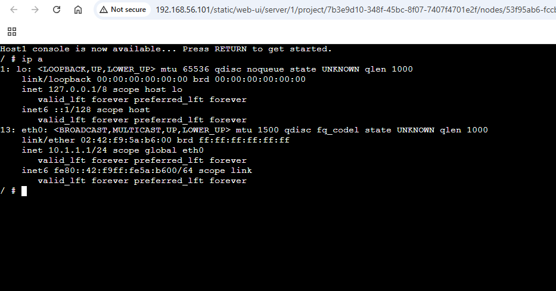
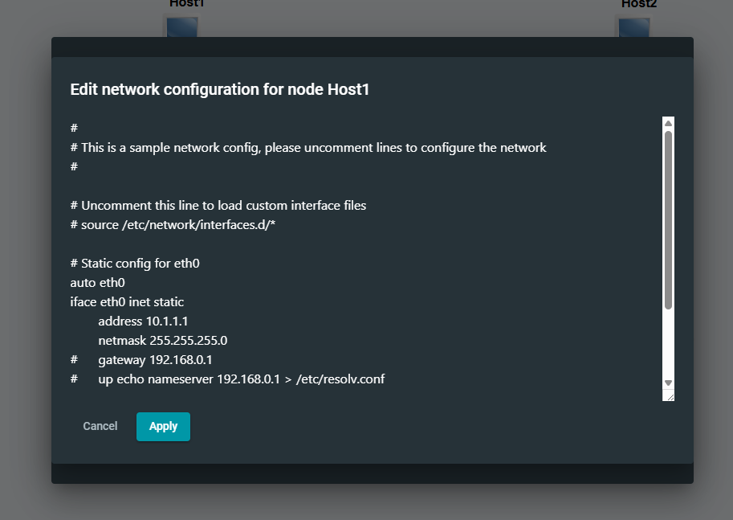
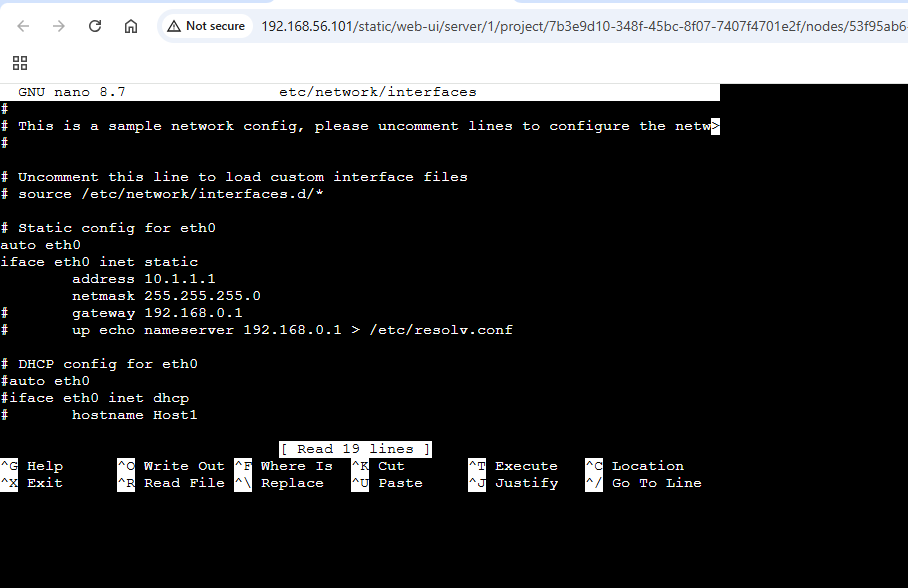
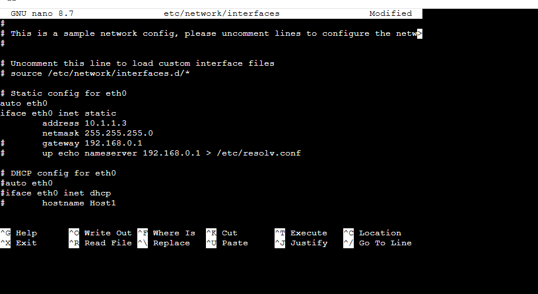
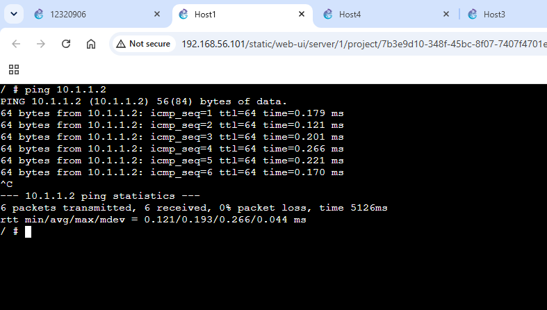
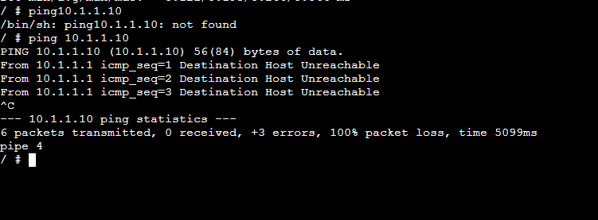
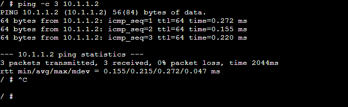
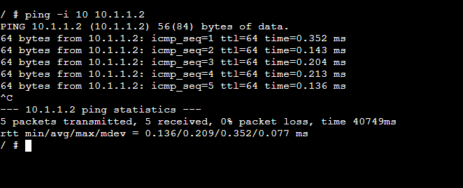

# Week 02 Tutorial

This report is a documentation of practical work done for Week 02 tutorial in GNS3. 
This tutorial covers three methods for assigning static IPv4 addresses to Linux hosts, verifying interface addressing and using ping to test connectivity and round trip time (RTT).

## Task 1: Setting Static IP Addresses
Goal: Set up four Linux hosts on one LAN and try out various ways of setting static IP addresses.

### 1 – Create the GNS3 topology
We have created a GNS3 project with 4 Linux hosts (Host1, Host2, Host3 and Host4) and one Ethernet Switch (Switch1). 
The links were added after the nodes were placed around the switch. This satisfies the tutorial requirement of having a LAN with four Linux hosts and one switch.

_Figure 1. create the gns3 topology._

## Step 2 – Connect all the Hosts to the Ethernet Switch
The eth0 interface of each Linux host was connected to a different port on Switch1. Once the nodes were started, 
the links turned green, indicating that the interfaces and links were active. If all four hosts are connected 
to the same Layer 2 switch, they are able to communicate directly if they have IPv4 addresses that are in the same subnet.

_Figure 2. connect all hosts to the ethernet switch._

## Step 3 – Check an assigned address with the ip address show
On Host1 we used the command `ip a` (short for `ip address show`) to see its interfaces.
The screenshot shows eth0 with the IPv4 address 10.1.1.1/24. The /24 prefix matches the subnet mask 255.255.255.0. 
The objective of this command is to check that the host has the desired address applied.

_Figure 3. verify an assigned address with ip address show._

## Step 4 – Setup a host in the GNS3 Configure Menu
We opened the GNS3 network configuration editor for Host1. The eth0 part is static, and has the fields `address`, `netmask` and optionally `gateway`. This technique modifies the Linux /etc/network/interfaces configuration from the GNS3 graphical interface. Settings entered here are applied when starting the node.

_Figure 4. configure a host using the gns3 configure menu._

## Step 5 – Edit /etc/network/interfaces in the console
nano /etc/network/interfaces Now I opened the file in nano. The static configuration has `auto eth0`, `iface eth0 inet static`, an IPv4 address and netmask 255.255.255.0. This demonstrates the second method of the tutorial, editing the Linux network configuration file directly from the console.

_Figure 5. edit /etc/network/interfaces from the console._

## Step 6 – Change the static address in nano
In nano, the static address was changed to 10.1.1.3 netmask 255.255.255.0. The configuration also includes a gateway line. If you edit this file on a live node you will need to reload the interface configuration for the new settings to take effect.

_Figure 6. change the static address in nano._

## Step 7 – Reload the interface and verify Host3
On Host3, the network configuration was edited and then ifdown eth0 and ifup eth0 were executed. These commands reload /etc/network/interfaces. The tutorial explains: Next run `ip a`. You should see eth0 is 10.1.1.3/24 which means the config took.

_Figure 7. reload the interface and verify host3._

## Step 8 – Assign an address immediately with the ip command
On Host4, the command ip addr add 10.1.1.4/24 dev eth0 was used. Then, running ip a shows eth0 has 10.1.1.4/24. This is the 3rd way to address in the tutorial. It takes effect immediately, but the change is not persistent after reboot unlike `/etc/network/interfaces`.

_Figure 8. assign an address immediately with the ip command._

# Task 2: Testing Network Connectivity and Delay with Ping
Use ping to determine the reachability of another host. To observe round trip time, packet loss, count, interval and packet-size behaviour.

## Step 9 – Basic ping between two valid hosts
Other host in the LAN sent normal `ping 10.1.1.2`. Multiple replies were received with TTL 64 and response times below a millisecond. ^C Command interrupted . Summary : 6 packets transmitted , 6 received , 0% packet loss . The average RTT was about 0.193 ms. This confirms that there is IP connectivity between the two hosts and it is working properly.

_Figure 9. basic ping between two valid hosts._

## Step 10 – Ping an unused/wrong IP address
The address 10.1.1.10 was tested and found to be an address that did not match an active host. The result was `Destination Host Unreachable`. The summary showed no successful replies. This illustrates how ping can find an unreachable destination, and how packet loss or error information indicates a connectivity problem.

_Figure 10. ping an unused/wrong ip address._

## Step 11 – Limit the number of ping requests
We gave the command ping -c 3 10.1.1.2 . The option `-c 3' limits the test to three ICMP Echo Requests, so the command will end by itself after three replies. The result showed 3 transmitted, 3 received and 0% packet loss. Average rtt was about 0.215 ms.

_Figure 11. limit the number of ping requests._

## Step 12 – Change the interval between requests
Tested the command ping -i 10 10.1.1.2. The `-i` option changes the time interval between sending ICMP Echo Requests . In this case , it is set for 10 seconds . The responses continued to confirm connectivity, but the rate of requests generated was much lower than that with the default interval.

_Figure 12.  change the interval between requests._

## Step 13 – Change the data size
The command used to set the ICMP payload size to 100 bytes was `ping -s 100 10.1.1.2`. In the output you can see 108 bytes in ICMP part with additional protocol header.All packets were received successfully, demonstrating that ping can also be used to test connectivity with different packet sizes.

_Figure 13. change the data size._ 

## Step 14 – Combine count, interval and size options
A number of non-default arguments are combined in the command `ping -s 100 -c 3 -i 2 10.1.1.2`. It waits two seconds between queries, transmits a 100-byte payload, and restricts the test to three requests. Three packets were sent, three were received, there was no packet loss, and the average RTT was roughly 0.173 ms, according to the result. This fulfils the tutorial's need to try out various ping possibilities.

_Figure 14. combine count, interval and size options._

# Conclusion
Three methods for configuring static IPv4 were shown in the Week 02 tutorial: utilising the GNS3 Configure menu, modifying `/etc/network/interfaces`, and utilising the `ip address add` command. Using `ip address show`, the set addresses were confirmed. Next, reachability was confirmed, an unreachable address was found, packet loss and RTT were monitored, and the effects of the `-c`, `-i`, and `-s` options were tested using Ping.The successful ping results with 0% packet loss confirm that the active hosts in the LAN were able to communicate through the Ethernet switch.
