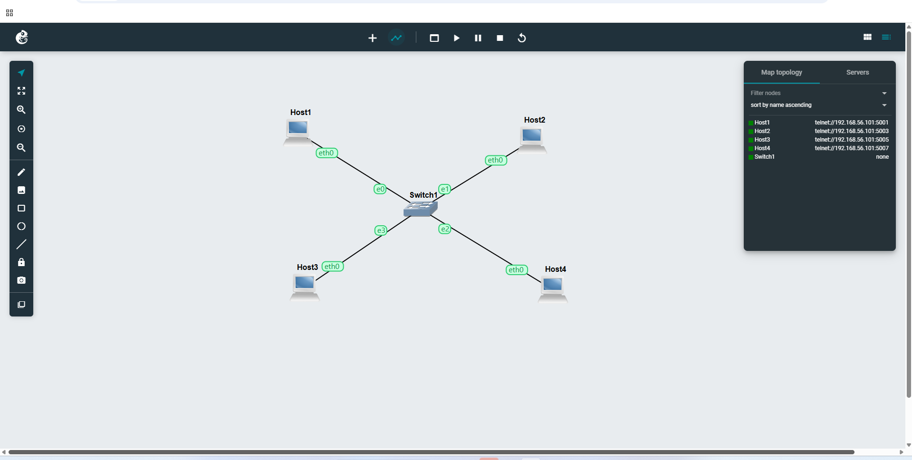
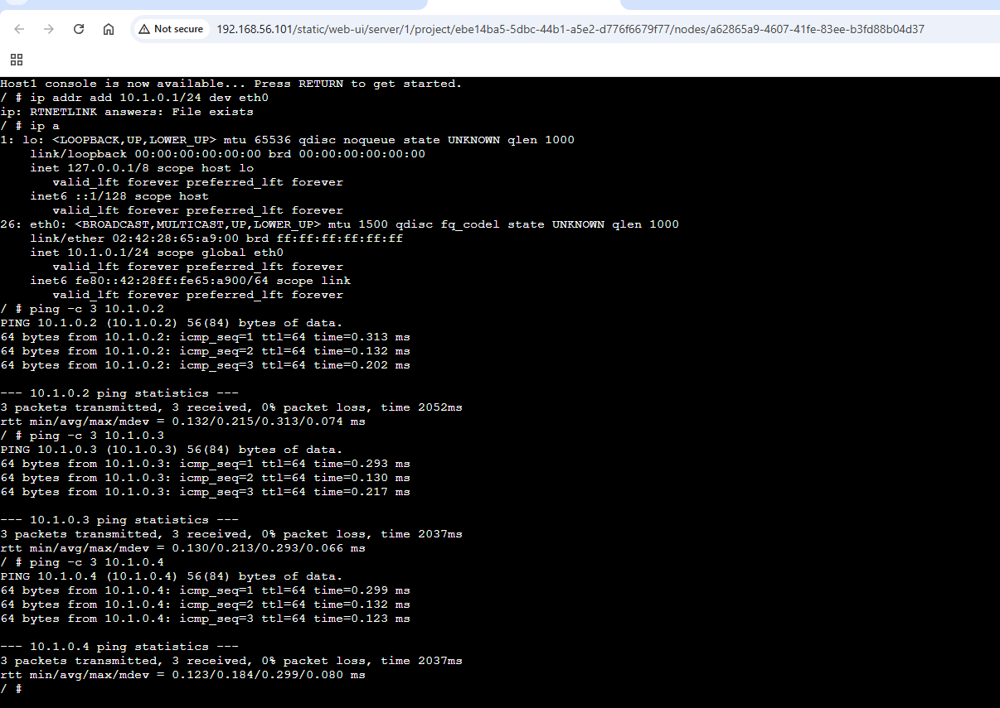
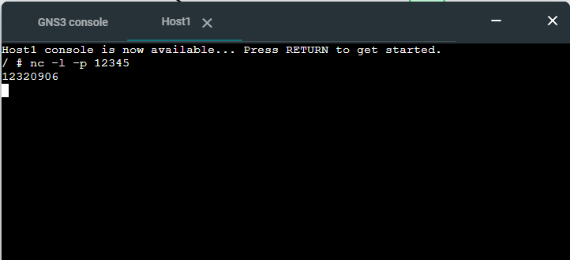
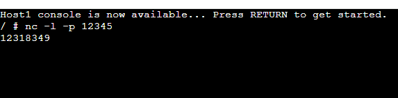
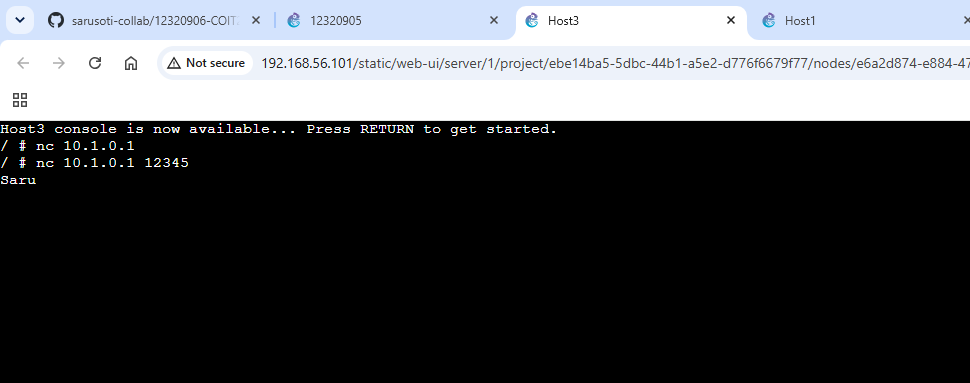
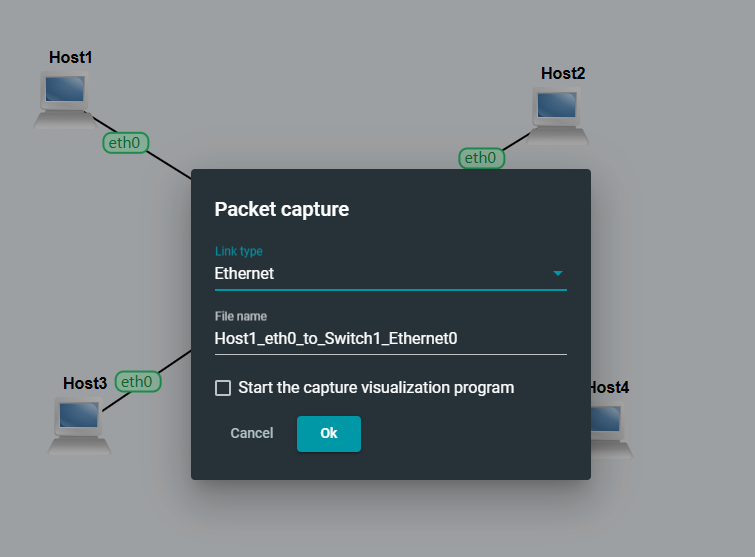
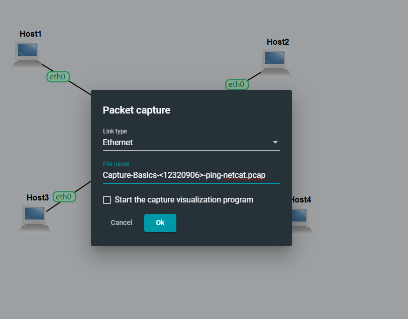
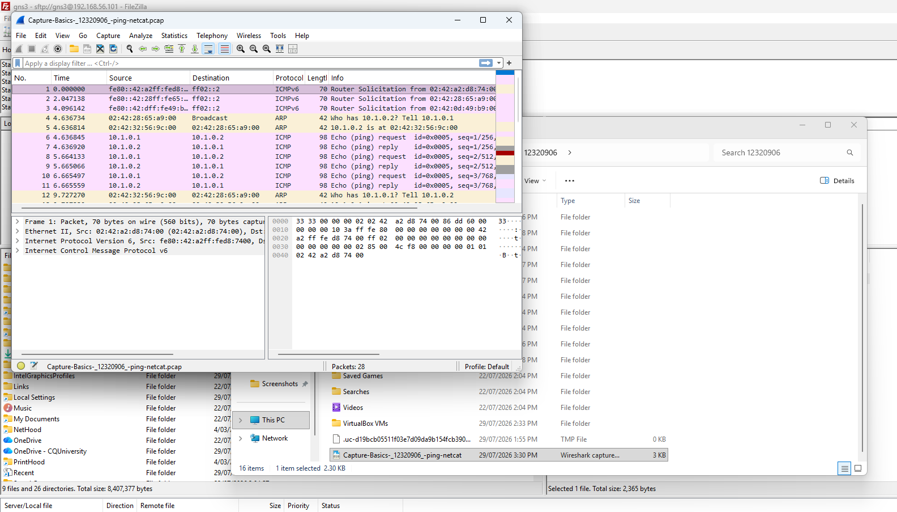

# Task 1: Simple Application Communications with Netcat

The completed GNS3 practical activities for Week 03 are documented in this report. It adheres to the provided instructional framework, which consists of basic application connection with Netcat, packet capture of ping and Netcat traffic, and transfer of the capture to the host machine.

**Aim:** To test basic application connections between Linux hosts, learn the fundamentals of Netcat (nc).

## Step 1: set up the LAN topology.
The four-host GNS3 LAN that was already in place was utilised. Switch1 is linked to Hosts 1, 2, 3, and 4 via their Ethernet ports. Every link is displayed as active. This enables direct communication between the hosts on a single LAN.

_Figure 1. prepare the lan topology_

## Step 2 – Verify IP connectivity
Host1 was verified with `ip a` prior to utilising Netcat, revealing address 10.1.0.1/24 on eth0. Then, using three requests for each location, Host 1 was able to successfully ping 10.1.0.2, 10.1.0.3, and 10.1.0.4. Prior to application-level testing, each test confirmed that the hosts could be reached by returning 3 sent, 3 received, and 0% packet loss.

_Figure 2. verify ip connectivity._

## Step 3 – Start a Netcat listening server
`nc -l -p 12345` was used to create a Netcat listener. The `-p` option indicates the local port, while the `-l` option puts Netcat in listen mode. The provided proof demonstrates that a remote Netcat client's text is accepted by the listener.

 

_Figure 3. start a netcat listening server._

## Step 4 – Connect a Netcat client to the server
Targeting Host1 at IP address 10.1.0.1 and TCP port 12345, the Netcat client was launched on a different host with the command `nc 10.1.0.1 12345`. The screenshots, which include the student ID and name/message content, demonstrate effective two-way text conversation. This demonstrates application-level communication between the two Linux hosts.

 

_Figure 4. connect a netcat client to the server_

## Step 5 – Confirm two-way Netcat messaging
Further Netcat data reveals a client session displaying the same ID along with the text `ellen` and a listener getting student ID 12318349. This verifies that text submitted on one endpoint was sent to the other endpoint when combined with the other Netcat images.

 
_Figure 5. confirm two-way netcat messaging._

The provided Week 03 instruction requests a server port different than 12345 and a single screenshot that displays both the client and the server. The screenshots that are currently available demonstrate Netcat operating successfully with distinct console views and port 12345. Instead of claiming a different port or a merged screenshot, this report details the work precisely as it appears in the provided proof.

# Task 2: Capturing Packets
Aim: Capture traffic on the Host1-to-switch link and transfer the resulting PCAP file to the Windows host.

## Step 6 – Start packet capture on the Host1 link

On the Ethernet connection between Host1 and Switch1, packet capture was initiated. The packet-capture dialogue of GNS3 was utilised with an Ethernet connectivity. This creates a PCAP capture file with the frames that traverse the chosen link.

_Figure 6. start packet capture on the host1 link._

## Step 7 – Name the packet capture

`Capture-Basics-<12320906>-ping-netcat.pcap` was supplied as the capture filename. In order to identify the capture as comprising both ping and Netcat traffic, the tutorial requires a filename based on `Capture-Basics-<studentid>-ping-netcat.pcap`.

_Figure 9. name the packet capture._

## Step 8 – Generate three ping requests during capture

Host1 executed `ping -c 3 10.1.0.2` while capture was in progress. The operation was restricted to three ICMP Echo Requests by the `-c 3` option. ICMP traffic was generated for the capture file after all three responses were received with 0% packet loss.

_Figure 10. generate three ping requests during capture._

## Step 9 – Generate Netcat traffic during capture

During the packet capture process, Netcat was also utilised. The screenshots display Netcat connection with the text `Saru` and 10.1.0.1 on port 12345.As needed by the packet-capture activity, this produced application traffic in addition to the ICMP ping packets.

_Figure 11. generate netcat traffic during capture._

## Step 10 – Transfer and verify the PCAP file

The PCAP file was moved from the GNS3 server to the Windows host after the capture was halted. The capture opened in Wireshark is seen in the last screenshot. ARP traffic and ICMP Echo request/reply packets between 10.1.0.1 and 10.1.0.2 are included in the packet list. This confirms that the PCAP file was accessible after transmission and that packets were correctly collected.

_Figure 10. transfer and verify the pcap file._

# Conclusion
Successful Linux host connectivity, basic Netcat client/server messaging, packet capture over a GNS3 Ethernet link, and the transmission and validation of the resultant PCAP file were all shown in the third week's practical. The sample includes network activity, including ARP and ICMP ping packets, according to the Wireshark evidence
