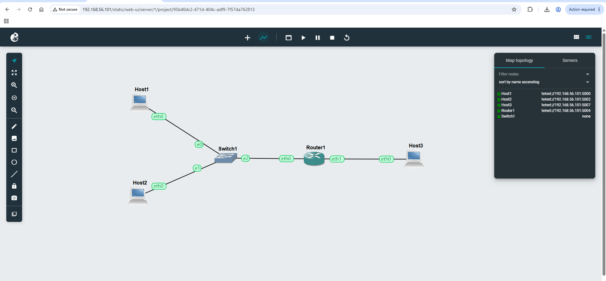
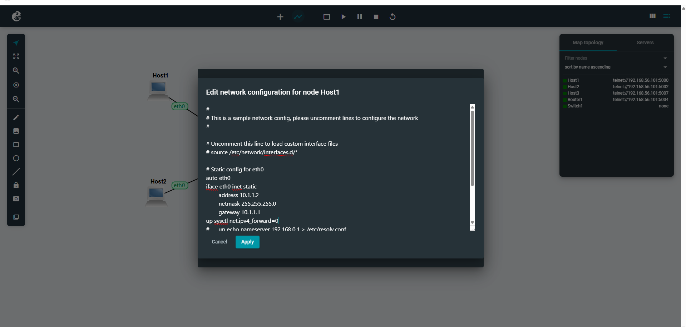
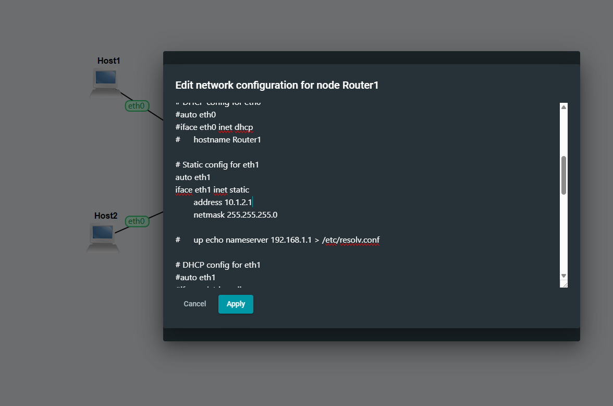
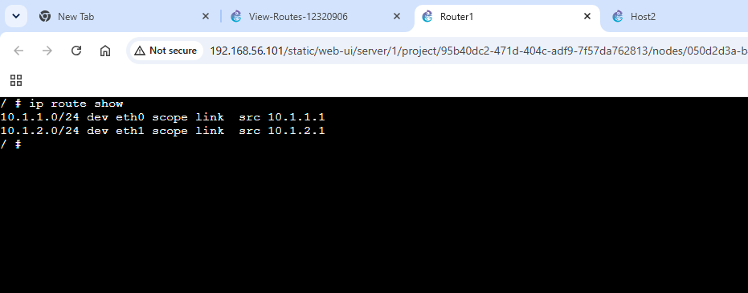
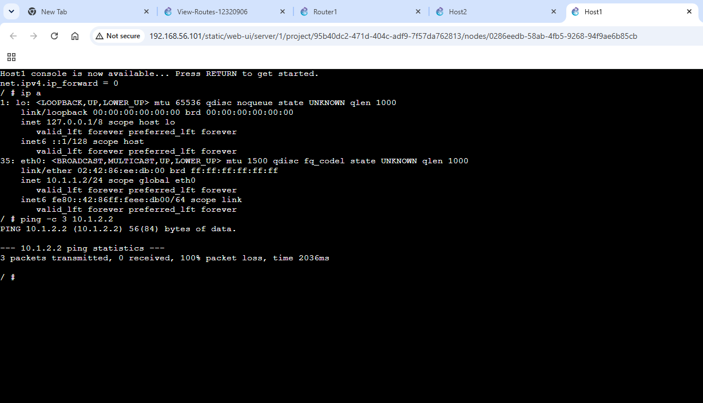
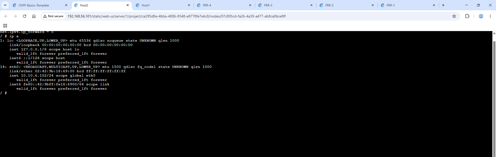
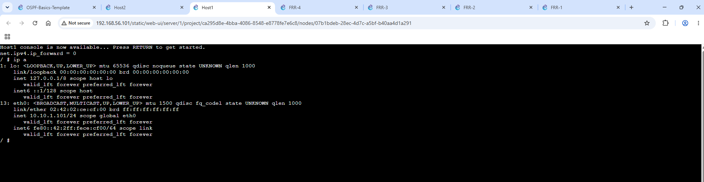
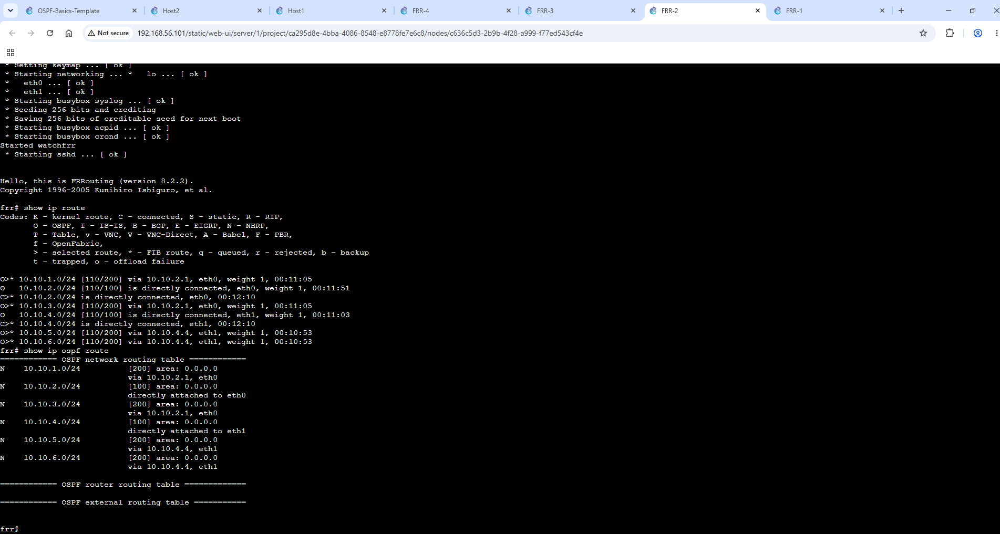
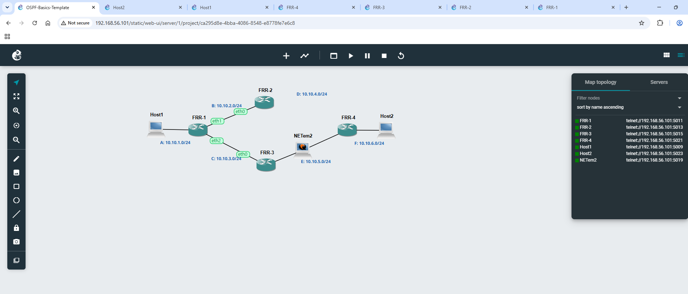
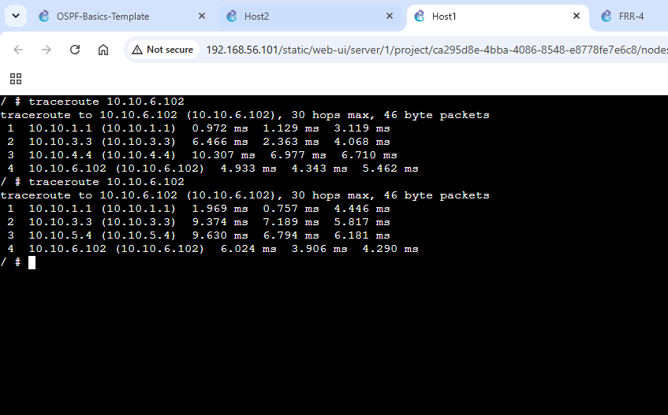

# Task 1: View Routing Tables 
This is complies with the criteria of the Week 05 instruction. Existing evidence that amply illustrates the necessary action has been incorporated. Where an extra screenshot, exported GNS3 project, or routing-table proof has to be submitted prior to submission, there are clearly noted placeholders.

**Aim**  : Acquire the ability to see routeing tables and activate forwarding on a router.

## 1.1 Network and Address Configuratio
The project creates two IPv4 subnets using three Linux servers, a Linux router, and an Ethernet switch. Static addressing and gateway setup on Host1 and Router1 are displayed in the screenshots.

_Figure 1. Host1 and Host2 connect through Switch1 to Router1, with Host3 on the second subnet._

_Figure 2. Host1 static network configuration. The screenshot shows address 10.1.1.2/24, gateway 10.1.1.1 and IP forwarding disabled._

_Figure 3. Router1 interface configuration evidence, including the second subnet interface 10.1.2.1/24._

## 1.2 Routing Table

Both subnets have directly linked routes in the Router1 routeing table: 10.1.1.0/24 via eth0 and 10.1.2.0/24 via eth1.

_Figure 4. Router1 output from 'ip route show' showing the two directly connected networks._

## 1.3 Ping Test
A host on one subnet must ping a computer on the other subnet. This cannot be presented as the necessary successful cross-subnet ping as the screenshot provided shows a failed ping from Host1 (10.1.1.2) to 10.1.2.2 with 100% packet loss.

_Figure 5. Ping attempt from Host1 to 10.1.2.2. This screenshot records the test but does not satisfy the required successful-ping output._

## 1.4 Required Project File
[The exported GNS3 project](https://github.com/sarusoti-collab/12320906-COIT20261/blob/main/OSPF-Basics-Template.gns3project)

## 1.5 Additional Routing Tables Needed

The IP addresses and routeing tables of every host and router are requested by the tutorial. The provided proof clearly displays the routeing table for Router1, however the screenshots do not clearly display the individual routing-table output for Host1, Host2, and Host3.

# Task 2: Dynamic Routing with OSPF
**Aim** : See how OSPF reacts to changes in the network and how dynamic routeing is configured.

## 2.1 OSPF Network

_Figure 6. OSPF topology containing Host1, Host2, FRR1–FRR4 and the NETem links._

An upper path via FRR2 and a lower path via FRR3 are the two other routes that the topology offers between Host1 and Host2. OSPF uses its metrics to dynamically choose routes.

## 2.2 FRR1 Neighbours and Routing Information

_Figure 7. FRR1 OSPF neighbour and routing information, including 'show ip ospf neighbor', 'show ip ospf route' and 'show ip route'._

OSPF neighbours on the 10.10.2.0/24 and 10.10.3.0/24 connections are reported by FRR1. Additionally, routes to the distant 10.10.4.0/24, 10.10.5.0/24, and 10.10.6.0/24 networks are displayed in its OSPF routeing output.

## 2.3 Routing Table for Two Routers

_Figure 8. Routing table evidence for FRR1._

_Figure 9. Routing information for FRR2, including OSPF-learned and directly connected routes._

## 2.4 Summary Routing Table

A summary containing Destination and Next Node columns for every router is required by the tutorial. Although the provided pictures offer compelling proof for FRR1 and FRR2, they do not include comprehensive, legible route tables for each destination for FRR3 and FRR4. For the final confirmed summary, the following space is set aside.

**Router	        |        Destination	Next Node**

FRR1	            |      [Insert verified destination subnet(s)]	[Insert directly connected / next-hop router]

FRR2	            |      [Insert verified destination subnet(s)]	[Insert directly connected / next-hop router]

FRR3              |      [Insert verified destination subnet(s)]	[Insert directly connected / next-hop router]

FRR4	            |      [Insert verified destination subnet(s)]	[Insert directly connected / next-hop router]

## 2.5 Traceroute Before and After Network Change

Evidence from traceroutes shows that the route can alter. A successful route from Host1 to Host2 (10.10.6.102) via 10.10.1.1 → 10.10.3.3 → 10.10.5.4 → 10.10.6.102 is seen in one screenshot.

_Figure 10. Successful traceroute from Host1 to Host2 using the lower OSPF path._

_Figure 11. Traceroute comparison showing alternative paths to Host2._

The final submission should explicitly state which traceroutes were conducted before and after the NETem link was interrupted in order to provide the strongest proof.

## 2.6 Required OSPF Project File

[OSPF Project File](https://github.com/sarusoti-collab/12320906-COIT20261/blob/main/OSPF-Basics-Template.gns3project)

